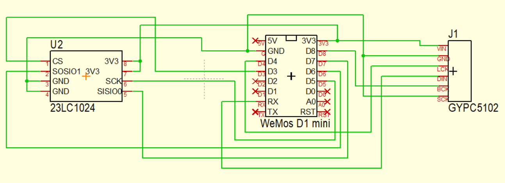

# espaudio
## Library for playing http streams

Audio class for I2S and direct audio.

- For ESP8266 and ESP32
- With or without SPIRAM
- With or without I2S DAC
- by Erik Palsbo.
- Github: https://github.com/palsbo
- Using library from https://github.com/earlephilhower/ESP8266Audio

##	ESP8266
Must run at 160mHz

	Tools->lwIP Variant->v1.4 Open Source, or V2 Higher Bandwidth
	Tools->CPU Frequency->160MHz

##	ESP32
	Problems with the ESP8266Audio library - ESP32 not yet implemented fully. Will play, but many errors.
	Do not use SPIRAM

### Definitions:

	#define SPIRAM                   //	Use SPIRAM if defined (see schematic later)
	#define DAC                      //	Use I2S DAC if defined

To define audio object:

	AUDIO myaudio;

### Methods

	myaudio.begin();                 //	init object
	bool x = myaudio.isPlaying()     //	is object playing?
	myaudio.start(char * url);       //	start playing url
	myaudio.start();                 //	start playing previous defined url
	myaudio.stop();                  //	stop playing
	myaudio.setGain(int value);      //	set gain value 0 - 100
	myaudio.loop();                  //	must be placed in void loop()

###	Signals:

	SIGNAL              ESP8266    Wemos-D1 ESP32
	------------------------------------------------------
	LRCK                GPIO2/TX1  D4       GPIO25      (Red)
	DATA                GPIO3/RX0  RX0      GPIO22      (Orange)
	BCLK                GPIO15     D8       GPIO26      (Yellow)
	23LC24   SPIRAM
	SIGNAL   23LC1024   ESP8266    Wemos-D1    ESP32
	------------------------------------------------------
	CS          1       GPIO0      D3
	SOSIO1      2       GPIO12     D6
	SIO2        3       GND        GND
	VSS         4       GND        GND
	SISIO0      5       GPIO13     D7
	SCK         6       GPIO14     D5
	HOLDSIO3    7       3V3        3V3
	VCC         8       3V3        3V3

PCB layout and schematic is available in the folder <arduino sketchfolder>/library/espaudio/hardware

